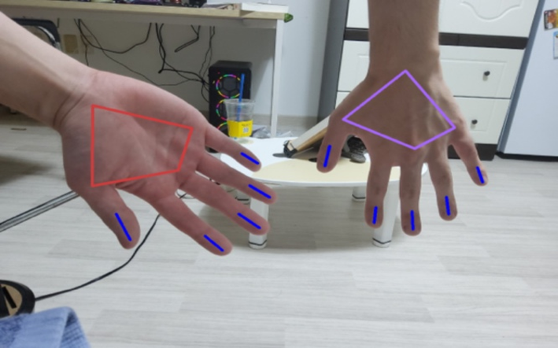
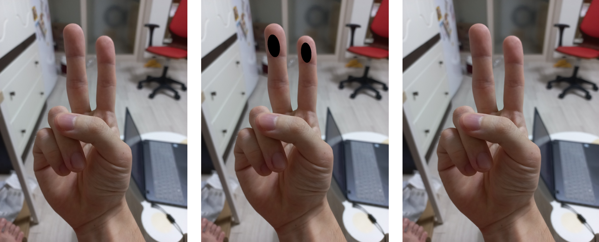
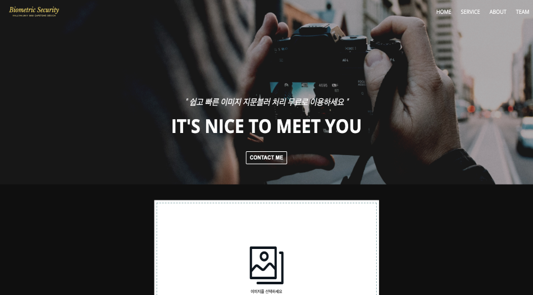
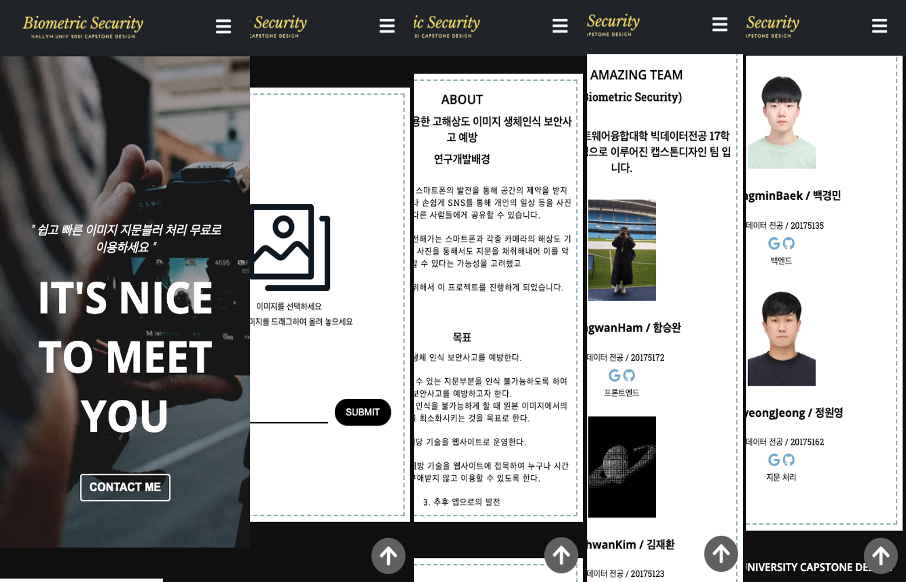

## 빅데이터 캡스톤 디자인

### 작품명: 기계학습을 이용한 고해상도 이미지 생체인식 보안사고 예방

---

### 팀 구성

> - 팀 명: **BS**
> - 팀 장: **빅데이터전공 함승완**
> - 팀 원: **빅데이터전공 김재환, 빅데이터전공 백경민, 빅데이터전공 정원영**

## 과제 목적

> 최근 ‘바이오 인증’은 ‘생체인식’ 또는 ‘바이오 매트릭스’라는 이름으로 여러 산업 분야에서 많은 관심이 집중되고 있다. 이러한 배경에는 보안 공격으로부터 더욱 안전하고, 편리하며, 신속한 서비스를 제공해주는 새로운 인증기술들이 지속해서 요구되어 왔기 때문이다. 우리는 ‘바이오 인증’의 여러 방법 중에서 지문인식에 관하여 관심을 가지고 프로젝트를 진행하게 되었다. 국내에서는 이전의 삼성 갤럭시 s10 지문 스캐너 해킹, 해외에서는 고해상도 사진을 이용해 실리콘으로 위조지문을 제작한 후 아이폰 지문인식 잠금 장치를 해제하는 시범도 보이기도 했었다. 이 사고 사례를 통해 우리가 자주 이용하는 소셜 네트워크 서비스 즉 SNS에 올리는 사진을 통해서도 이러한 지문정보를 악용하는 사고가 발생할 수 있다는 가능성을 생각했다. 그리고 이 해당 바이오 기술이 향후 발전을 해나갈지라도 이를 해킹하는 기술 또한 나날이 발전해 갈 것으로 생각한다. 그래서 이 문제를 해결하기 위해 사진상의 손가락을 찾아내고 그 손가락의 지문 부분을 블러처리 하는 기술을 구현하였다.

---

## 과제 진행

### 1. detect finger

- 오픈소스 MediaPipe의 hand detection이용하여 손가락 탐지
    
- 손바닥, 손등 구별
    
  
    
- 손가락 접힘여부 판별

---

### 2. 지문 블러 처리

- 지문 부분 특정하여 검은색 타원 그리기
- 검은색 타원 영역에 블러처리된 지문영역을 넣어 블러처리 결과를 생성
    
  

---

### 3. 웹사이트 개발 및 배포

- PC
    
  

- MOBILE
    
  

- 배포
    
  
  

---

## 활용 방안 및 기대효과

> 웹상에서 친구, 선후배, 동료 등 지인과의 인맥 관계를 강화하고 또 새로운 인맥을 쌓으며 폭넓은 인간관계를 형성할 수 있도록 해주는 서비스를 ‘소셜 네트워크 서비스’ 라고 한다. 이 서비스의 특징은 인터넷에서 개인의 정보를 공유할 수 있게 하고 의사소통을 도와주는 1인 커뮤니티인데 이 특징에서 개인의 정보를 공유하는 데에 있어서 일어날 수 있는 보안사고를 효과적으로 예방하는 일에 활용가치가 있어 보인다. 더 나아가, Facebook, Instagram 등 현재 서비스 하고 있는 SNS 와 더불어 앞으로 출시할 여러종류의 SNS 기업들과 협업하여 사용자가 이미지를 업로드 하는 과정에서 기본적으로 블러처리하는 기술을 적용하여 보안 사고를 예방해주는 역할을 할 수 있을 것으로 기대한다.

## To - do

> 다중 사용자 이용 시 문제 해결  
> 데이터 처리 프로세스 단축(저장 후 삭제 => 바로 반환)
